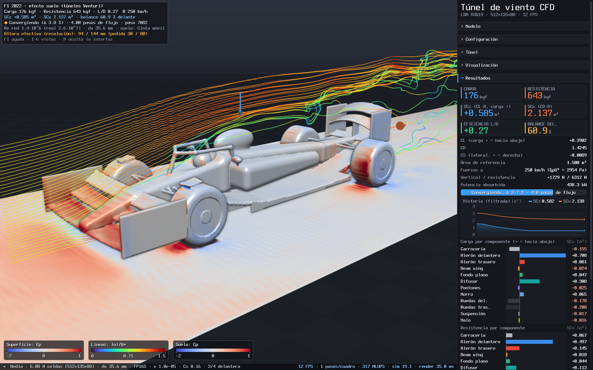
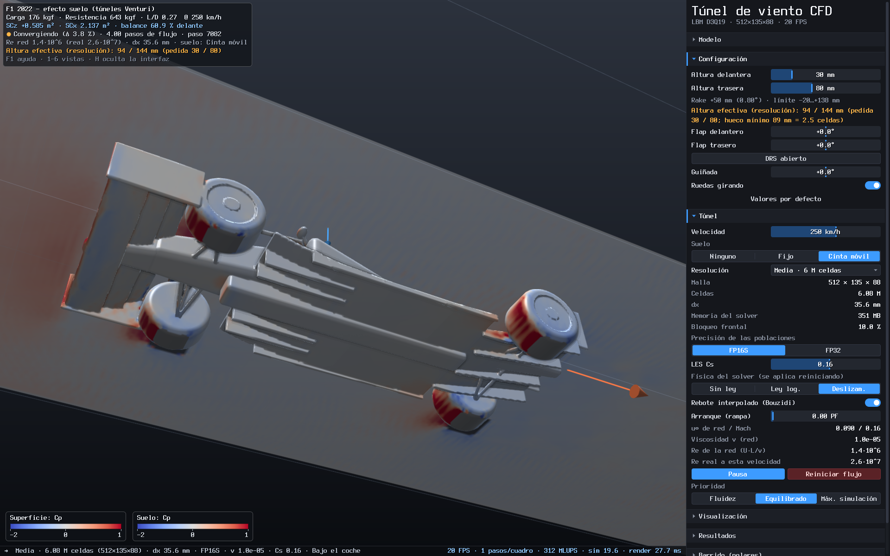
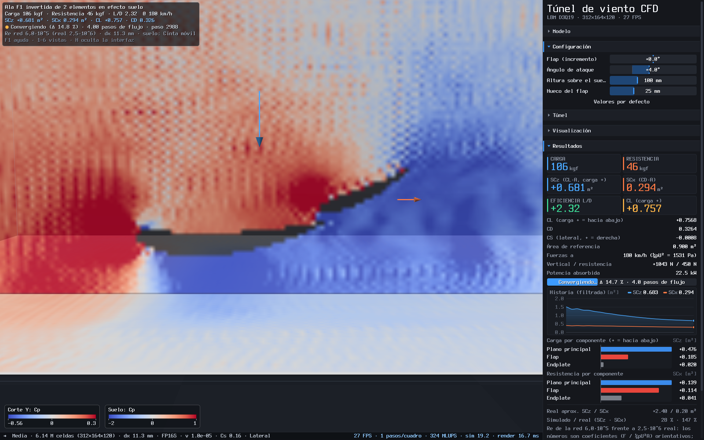
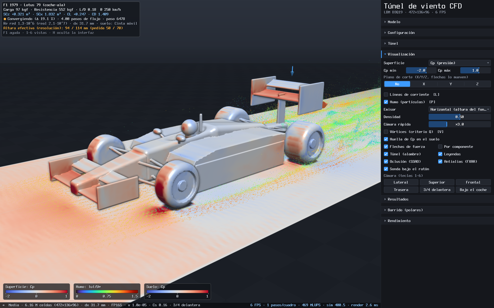

# Túnel de viento CFD 3D — Lattice Boltzmann en C++23 puro

Simulador **interactivo** de túnel de viento para estudiar la aerodinámica de objetos, alas y
**coches de Fórmula 1 de nueve épocas reglamentarias (1967 → 2026)**, con efecto suelo (sin suelo,
suelo fijo o **cinta móvil**) y ruedas que giran. Todo está escrito desde cero en C++23 sin
dependencias salvo Xlib/XShm para la ventana: el solver LBM, la geometría (SDF, voxelizado,
mallado), el rasterizador por software, la visualización del flujo, la interfaz, las fuentes y el
PNG. Está afinado para el **Intel Core Ultra 7 155H** (6 P-cores con HT + 8 E-cores + 2 LP-E;
AVX2/FMA/F16C, sin AVX-512; ~82 GB/s de memoria).



| | |
|---|---|
|  |  |
| Vista inferior (suelo translúcido) con la huella de Cp y la altura efectiva | Ala F1 de 2 elementos a 100 mm del suelo: succión bajo el ala |
|  | |
| Lotus 79 (1979), humo desde un rastrillo a la altura del fondo | |

## Qué hace

* **Solver**: Lattice Boltzmann D3Q19 con streaming *Esoteric-Pull* in-place (una sola copia de las
  poblaciones), almacenamiento **FP16S** (o FP32), colisión regularizada recursiva (3er orden) con viscosidad de volumen + LES Smagorinsky, rebote
  en sólidos con paredes móviles (ruedas, cinta), entrada/salida/campo lejano, esponja de salida y
  fuerzas por pieza (intercambio de momento). ~800 MLUPS en FP16S en este portátil con un F1 a
  resolución media (núcleo ~950 MLUPS + la pasada de fuerzas/pared del rebote interpolado).
* **Modelos paramétricos** (18): nueve F1 (Lotus 49 de 1967, Lotus 79 coche-ala, vía estrecha de
  1998, apéndices de 2008, alerón ancho + DRS de 2011, híbrido de 2014, coches anchos de 2019, efecto
  suelo de 2022 y aero activa de 2026 con modos Z/X), alas NACA 0012/4412, ala F1 de 2 elementos en
  efecto suelo, perfil pseudo-2D, esfera, cilindro, cubo, cuerpo de Ahmed y un turismo tipo DrivAer.
  Parámetros en vivo (sin reiniciar el flujo): alturas de marcha (rake limitado), flaps, DRS/modo X,
  guiñada, ángulo de ataque, altura sobre el suelo, hueco del flap, ruedas girando.
* **Resultados**: carga y resistencia (N, kgf), `SCz = CL·A` y `SCx = CD·A` (m², convención F1),
  L/D, **balance aerodinámico** (% delante, por equilibrio de momentos), CL/CD/CS, potencia
  absorbida, **desglose por componente** (alerones, fondo, difusor, ruedas...), historia temporal,
  convergencia y comparación con valores reales aproximados.
* **Barridos (polares)**: ángulo de ataque, altura del ala, altura de marcha, flaps, guiñada o
  hueco del flap; asentamiento + promedio por punto, gráfica en vivo y exportación CSV.
* **Visualización**: superficie coloreada por Cp / velocidad junto a la pared / componente /
  vóxeles (lo que ve el solver); plano de corte X/Y/Z (velocidad, u_x, u_z, Cp, Cp total,
  vorticidad, criterio Q, con vetas LIC opcionales) con sonda bajo el ratón; líneas de corriente y
  humo (partículas) con varios rastrillos; volumen de vórtices por criterio Q (isosuperficies o
  nube); huella de Cp en el suelo; cinta animada; flechas de fuerza (total y por componente);
  alambre del túnel; leyendas de color.
* **Interfaz**: panel lateral en español con secciones plegables (tema oscuro), HUD, barra de
  estado, ayuda (F1), avisos, cámara orbital con vistas predefinidas, atajos de teclado, capturas
  PNG. Escalado 2× automático en pantallas 4K (framebuffer 1920×1200 → 3840×2400 con AVX2).
* **Rendimiento en tiempo real**: pasos de red por cuadro adaptativos para mantener ~30 FPS
  (prioridad *fluidez / equilibrado / máxima simulación*), **cero asignaciones de memoria por
  cuadro**, visualización recalculada sólo cuando cambia algo.

## Compilar

Requisitos: g++ ≥ 14 (C++23), GNU make, Xlib + XShm (`libx11-dev`, `libxext-dev`). La CPU debe
tener AVX2 + FMA + F16C (`-march=native`).

| Orden | Resultado |
|---|---|
| `make -j16` | binario optimizado con LTO → `build/cfd` |
| `make pgo` | optimización guiada por perfil: instrumenta, ejecuta `cfd --bench-pgo` (~30 s sin instrumentar; ~7 min instrumentado con la máquina cargada) y recompila → `build/cfd` |
| `make unity` | *jumbo build*: todo el programa en una unidad de traducción → `build/cfd_unity` |
| `make debug` | `-O1 -g` con ASan + UBSan → `build-debug/cfd` |
| `make test -j16` | compila y ejecuta todos los tests (`tests/test_*.cpp`) |
| `make bench` | benchmark del solver (MLUPS por hilos y precisión) |
| `make tools` | herramientas (`tools/*.cpp`: vista previa de modelos, benchmark LBM) |

`MARCH=meteorlake make` fija la arquitectura en vez de `native`; `BUILD=otro_dir make` compila en
otro directorio.

## Ejecutar

```sh
./build/cfd                                   # ventana: F1 2022, resolución media, cinta móvil
./build/cfd --model f1_1979 --res alta        # Lotus 79 con 13 M celdas
./build/cfd --model f1_2026 --param drs=1     # 2026 en modo X (baja resistencia)
./build/cfd --model f1_wing_ge --param height=60 --param aoa=6
./build/cfd --list                            # catálogo de modelos
```

### Controles

| Entrada | Acción |
|---|---|
| Ratón izquierdo | orbitar la cámara |
| Ratón derecho / central | desplazar |
| Rueda | zoom |
| Doble clic | centrar la cámara en el punto bajo el ratón |
| `1` … `6` | vistas: lateral, superior, frontal, trasera, 3/4, bajo el coche |
| `Espacio` | pausa / reanudar |
| `R` | reiniciar el flujo |
| `G` | ciclar el suelo: ninguno → fijo → cinta móvil |
| `D` | DRS (2011-2025) / modo X (2026) |
| `C` | ciclar el color de la superficie |
| `X` / `Y` / `Z` | plano de corte en ese eje (repetir = quitar) |
| Flechas (`Mayús` = ×10) | mover el plano de corte |
| `L` / `P` / `V` | líneas de corriente / humo / vórtices |
| `H` | ocultar la interfaz |
| `F12` o `S` | captura PNG en `./capturas/` |
| `F11` | pantalla completa |
| `F1` | ayuda |
| `Esc` | cerrar ayuda o desplegable; dos veces seguidas = salir |

La sonda muestra |u|/U∞, Cp y Cp total bajo el ratón (sobre el plano de corte si lo hay).

### Línea de órdenes (también sin ventana)

```sh
# 2 pasos de flujo sin ventana, captura PNG con la interfaz y CSV de coeficientes
./build/cfd --headless --model f1_2022 --res media --ft 2 --shot f1.png --csv f1.csv

# corte Y con Cp, vista lateral, sin líneas
./build/cfd --headless --model f1_wing_ge --ft 3 --view lateral --vis slice-y,q=cp,nostreamlines --shot ala.png

# polar de altura del ala en efecto suelo (asentar 1.5 + promediar 1 paso de flujo por punto)
./build/cfd --headless --model f1_wing_ge --sweep height:25:200:6 --csv polar_altura.csv

# benchmark (MLUPS y desglose del cuadro) y carga para PGO
./build/cfd --bench --res alta
./build/cfd --bench-pgo

# ventana que se cierra sola (medir FPS)
./build/cfd --res media --quit-after 20
```

Opciones principales: `--model`, `--res rapida|media|alta|ultra` (2.5 / 6 / 13 / 28 M celdas),
`--cells N`, `--ground none|static|moving`, `--speed km/h`, `--param clave=valor` (`ride_front`,
`ride_rear`, `ride`, `front_flap`, `rear_flap`, `drs`, `yaw`, `aoa`, `height`, `gap`, `wheels`),
`--fp32`, `--nu`, `--cs`, `--wall none|log|slip`, `--bb interp|implicit`, `--ramp PF`, `--threads`,
`--headless`, `--steps N` / `--ft F`, `--view`, `--cam`,
`--vis lista`, `--panel secciones`, `--shot`, `--csv`, `--sweep param:desde:hasta:n`
(`--settle`, `--avg`), `--bench`, `--bench-pgo`, `--stability`, `--size AxB`, `--scale N`,
`--prio`, `--pause`, `--frames N` / `--quit-after S`. `cfd --help` las lista todas.

## Física: qué se simula y sus límites

<!-- FISICA -->
* **Coeficientes, no números de carrera.** El Reynolds de la red (~10⁵–10⁶) es 10-100 veces menor
  que el real (~10⁷ para un F1 a 250 km/h) y la malla (centímetros) no resuelve capas límite. Los
  coeficientes sirven para comparar tendencias (épocas, alturas, flaps, DRS/modo X, suelo fijo frente
  a cinta, guiñada), no para predecir la carga de un coche concreto. Los valores "reales aprox." del
  catálogo son estimaciones de orden de magnitud; el panel muestra el cociente simulado/real.
* **Pared.** Por defecto la pared usa el rebote interpolado de Bouzidi (la superficie real, no la
  escalera de vóxeles) con un modelo de pared (*deslizamiento parcial + tensión de pared*; también
  "ley logarítmica" o "sin ley", panel Túnel → Física del solver, o `--wall`, `--bb`). La tensión de
  pared usa el Reynolds **real** de la velocidad elegida: la velocidad no sólo reescala N/kgf,
  también cambia (poco) la fricción.
* **Altura de marcha efectiva.** Bajo el fondo hacen falta ~3.5 celdas de hueco para que pase aire
  (con 2.5 el fondo de los F1 seguía dando sustentación): con alturas menores la red sube el coche (la menor
  altura h pasa a (h⁴ + g⁴)^¼, g = 3.5·dx, rake conservado; ≈ h en cuanto h ≳ 1.5·g). A resolución media
  (dx 35.6 mm) un F1 2022 pedido a 30/80 mm se simula a **125/175 mm** (97/147 a Alta, 76/126 a Ultra); el
  panel y el HUD lo indican en ámbar. Consecuencia: a Media/Alta un barrido de altura de un F1 por debajo de
  ~10 cm apenas cambia la geometría simulada (10/60 y 30/80 dan los dos 125/175 mm) y sus diferencias son
  ruido. Para estudiar el efecto suelo de verdad usa el ala aislada (`f1_wing_ge`, dx de 10-15 mm).
* **Fuerzas.** Intercambio de momento por pieza, manométrico (p − p∞: una pieza apoyada en el suelo,
  como un neumático, no recibe la presión absoluta del fluido) y galileanamente invariante en paredes
  móviles (ruedas que giran, cinta). La carga es positiva hacia abajo; el balance es el % de la carga
  vertical sobre el eje delantero por equilibrio de momentos (incluye el momento de la resistencia).
* **Túnel.** Entrada y laterales/techo de campo lejano con bloqueo ≤ 10 % (coches) o ≤ 5 % (cuerpos),
  esponja de salida en el 12 % final; arranque impulsivo (el primer medio paso de flujo no entra en
  la media de fuerzas). La vista **Vóxeles** muestra exactamente la geometría que ve el solver.
* **Cp de referencia.** Como en un túnel real, Cp y Cp0 (superficie, suelo, líneas, cortes y sonda) se
  refieren a la presión estática medida aguas arriba del objeto (ρ medio de un plano entre la entrada y el
  objeto), no a la densidad inicial de la red; el panel Visualización muestra la diferencia. Durante el
  primer paso de flujo tras un reinicio se ven ondas de presión del arranque impulsivo (el HUD lo indica).
<!-- /FISICA -->

Detalle completo (método, pruebas de las correcciones de fuerza, tabla de calibración y guía de qué
predice y qué no) en [`docs/FISICA.md`](docs/FISICA.md).

### Estado de la calibración (honesto)

Preset **Media** (6 M celdas, dx 29-36 mm en los coches), 4 pasos de flujo (coches) o 5 (objetos), cinta
móvil y ruedas girando, alturas por defecto de cada época (suben a ~12-15 cm efectivos por la resolución).
Valores de `docs/FISICA.md` §5.1 (media de los 2 últimos pasos de flujo); entre paréntesis, una medida
independiente de la revisión con `cfd --headless --res media --ft 4|5` (media exponencial de la app).
Ruido entre tandas: ±0.05-0.1 m² en SCz de un F1.

| Modelo | SCz simulado (m², carga +) | SCz real aprox. | SCx simulado (m²) | SCx real aprox. |
|---|---|---|---|---|
| F1 1967 (Lotus 49) | −0.22 (−0.21) | −0.20 | 0.95 (0.94) | 0.75 |
| F1 1979 (Lotus 79) | +0.42 | 2.40 | 1.55 | 0.95 |
| F1 1998 | +0.58 | 2.90 | 1.64 | 1.05 |
| F1 2008 | +0.33 | 3.60 | 1.62 | 1.25 |
| F1 2011 (DRS cerrado / abierto) | +0.38 / +0.34 | 3.80 | 1.76 / 1.69 | 1.20 |
| F1 2014 | +0.32 | 3.30 | 1.69 | 1.10 |
| F1 2019 | +0.58 | 5.00 | 2.07 | 1.35 |
| F1 2022 (DRS cerrado / abierto) | +0.62 / +0.16 (+0.55 / +0.19) | 4.40 | 2.01 / 1.91 (2.02 / 1.88) | 1.15 |
| F1 2026 (modo Z / modo X) | +0.39 / −0.12 | 3.40 | 1.85 / 1.75 | 0.95 |
| Ala F1 en efecto suelo, h = 60 / 300 mm (CL) | 1.06 / 0.88 (1.02 / 0.87) | — | — | — |
| Esfera (CD) | — | — | CD 0.34 | CD 0.47 (subcrítico) |
| Cubo (CD) | — | — | CD 0.95 | CD 1.05 |
| Cuerpo de Ahmed 25° (CD) | — | — | CD 0.65 | CD 0.285 |

Lo que **sí** sale bien: el Lotus 49 sin alerones con ligera sustentación y muy por debajo del resto, el
F1 2022 como el que más carga (a Media y a Alta), el modo Z del 2026 por debajo del 2022, la dirección de
los efectos de DRS y modo X (menos resistencia y menos carga), el signo de la fuerza lateral con guiñada,
la jerarquía de resistencias de los cuerpos romos y el ala en efecto suelo (la carga sube al bajar hasta
h/c ≈ 0.08 y cae por debajo, como en Zerihan y Zhang). Lo que **no**: la carga de los F1 sale **5-10 veces
menor** que la real y la resistencia 1.3-1.8 veces mayor (L/D 0.2-0.45 frente a 2.5-4: alerones de 7-10
celdas de cuerda, ranuras de una celda, alerón trasero en una estela lenta); el orden de las épocas
intermedias (1979-2014) queda dentro del ruido; el DRS quita sólo un 4-7 % de resistencia (real 10-25 %);
el balance sale disperso (el panel lo marca en rojo si cae fuera de la batalla); los cuerpos redondeados
(Ahmed, turismo) dan el doble de CD. Úsense los números para **comparar** configuraciones a la misma
resolución, no como valores absolutos.

## Arquitectura

| Módulo | Archivos | Qué hace |
|---|---|---|
| core | `src/core/` | matemáticas, SIMD (AVX2, FP16), memoria alineada + THP, pool de hilos para CPU híbrida, PNG |
| geom | `src/geom/` | escena SDF por grupos, voxelizado jerárquico, mallado *Surface Nets* y de vóxeles |
| models | `src/models/` | catálogo paramétrico (9 F1 + 9 objetos), rangos y marcos (altura, rake, guiñada) |
| lbm | `src/lbm/` | solver D3Q19 Esoteric-Pull FP16S/FP32, fronteras, paredes móviles, fuerzas por id |
| render | `src/render/` | rasterizador por tiles (28.4, sombreado diferido, SSAO, FXAA), dibujo 2D, visualización del flujo |
| ui / platform | `src/ui/`, `src/platform/` | GUI inmediata, ventana X11 + MIT-SHM con escalado 2× AVX2, modo sin ventana |
| app | `src/app/` | dominio y física de la aplicación (`sim.cpp`), vista 3D (`view.cpp`), panel/HUD (`panel.cpp`), CLI (`cli.cpp`), bucle (`app.cpp`) |

Un cuadro: entrada → panel (UI inmediata) → cambios pendientes (reconstrucción con antirrebote: el
flujo no se reinicia al mover un deslizador) → *k* pasos del solver (*k* adaptativo) → fuerzas y
coeficientes (media exponencial) → actualización de la visualización (sólo si hay campo nuevo o
cambian los ajustes) → render 3D → HUD → UI → presentación. Ver
[`docs/ARCHITECTURE.md`](docs/ARCHITECTURE.md) y [`docs/MODELOS.md`](docs/MODELOS.md).

## Rendimiento

<!-- RENDIMIENTO -->
Medido en el Core Ultra 7 155H (20 hilos: 6 P + 8 E + hermanos HT; FP16S; F1 2022 con líneas de
corriente, huella de Cp, flechas y panel). **Casi toda la sesión hubo carga ajena en la máquina** (otro
ingeniero calibrando el solver con 20 hilos: carga media 15-45); sólo hubo dos ventanas tranquilas de
~1 minuto. Se indica la carga (media de 1 min al empezar) en cada fila. Dos generaciones del solver:
la de las 07:19 (rebote en escalera) y la actual (rebote interpolado de Bouzidi + ley de pared, cuya
pasada de fuerzas/pared es ~3× más cara).

| Caso | Celdas | Solver | Cuadro completo | Desglose del cuadro |
|---|---|---|---|---|
| **Actual**, `--bench --res media`, k = 4 pasos/cuadro, sin ventana (12:15, carga 1.8) | 6.08 M (512×135×88, dx 35.6 mm) | **790 MLUPS** (núcleo 6.5 ms/paso + fuerzas y pared 1.2 ms/paso) | 47.5 ms (21 FPS) | sim 35.8 · vis 4.0 · render 7.5 (malla 1.9, flujo 1.4, post 1.8) · UI 0.14 ms |
| Actual, ídem (13:20, carga ~1 instantánea, 18 de media) | 6.08 M | 824 MLUPS (mediana de 5 lotes; el último, ya con carga: núcleo 7.7 + fuerzas 1.7 ms/paso) | 57.9 ms | sim 40.7 · vis 4.9 · render 11.4 · UI 0.18 ms |
| Solver de las 07:19, `--bench --res media`, k = 4 (carga 4-8) | 6.08 M | 920 MLUPS (núcleo 6.3 + fuerzas 0.45 ms/paso) | 39.2 ms (25.5 FPS) | sim 30.5 · vis 3.0 · render 5.3 · UI 0.3 ms |
| Solver de las 07:19, ventana X11 3840×2262 (escala 2, MIT-SHM), media, "equilibrado" (carga ~12) | 6.08 M | 701 MLUPS en el cuadro | **32.8 FPS** (30.5 ms), 3 pasos/cuadro | sim 24.3 · vis 0-3 (≤ 12 Hz) · render 4.7 · UI 0.13 · presentación 0.7 ms |
| Actual, ventana X11, rápida, 30 s con entrada sintética continua (carga ~20) | 2.56 M (384×101×66) | 535 MLUPS | **24.1 FPS** (41.5 ms), 6 pasos/cuadro | sim 24.4 · vis 1.6 · render 18.0 · UI 0.2 · presentación 0.75 ms |
| Actual, ventana X11, media / alta, "equilibrado" (carga ~33, sólo orientativo) | 6.08 M / 13.25 M | 283 / 221 MLUPS | 18.3 / 7.2 FPS, 1 paso/cuadro | media: sim 22 · vis 4.9 · render 26 · presentación 1.4 ms |

* Con la máquina en reposo la simulación se lleva ~75 % del cuadro: el resto (visualización, render,
  UI, presentación) cuesta ~11-12 ms a media. Con el objetivo de 30 FPS ("equilibrado") eso deja 2-3
  pasos de red por cuadro a media (~7.7 ms por paso) y 1 a alta (13.25 M celdas: ~17 ms por paso a
  ~790 MLUPS; estimado, no hubo ventana tranquila para medirlo), que baja a ~15-20 FPS; "máx.
  simulación" da 4-5 pasos a ~12 FPS a media. Con carga ajena, el render (20 hilos compartidos) sube de
  ~8 a 18-26 ms y el planificador se queda en 1 paso/cuadro.
* Reconstrucción geométrica al mover un deslizador (modelo + vóxeles + solver + malla 0.5·dx): 85 ms a
  media en reposo (set_geometry 60 ms: el rebote interpolado precalcula las distancias a la pared),
  1 por cuadro como máximo (antirrebote a ≤ 8/s mientras se arrastra).
* **`make pgo` y `make unity`**: con el solver de las 07:19 (4 rondas intercaladas de `--bench --res
  media`, carga 13-31, mejor de 4): LTO 543 MLUPS / 54.7 ms por cuadro, unity 575 / 61.8 ms, PGO 542 /
  61.0 ms → **sin diferencia medible**. Con el solver actual se repitió (LTO, unity y PGO intercalados,
  13:20-13:26) pero la carga ajena subió a 18-37 en cuanto empezó y las cifras (200-824 MLUPS en el mismo
  binario) no permiten concluir nada. Es lo esperable: el núcleo LBM está limitado por la memoria (≈ 94 %
  del techo) y el resto del cuadro es pequeño. `make pgo` tarda ~7 min con la carga de perfilado
  instrumentada; el binario PGO es más pequeño (1.5 MB frente a 2.0 MB).
<!-- /RENDIMIENTO -->

Cómo medir en tu máquina: `cfd --bench --res media|alta` (solver puro, reconstrucción geométrica y
cuadros completos sin ventana con *k* fijo) y `cfd --res media --quit-after 20` (ventana real: al
salir imprime las medianas de cuadro, simulación, visualización, render, UI y presentación). El panel
**Rendimiento** muestra lo mismo en vivo, con una gráfica del tiempo por cuadro.

## Optimizaciones

Índice con cifras medidas en [`docs/OPTIMIZACIONES.md`](docs/OPTIMIZACIONES.md); detalle por módulo
en [`docs/opt/`](docs/opt/) ([lbm](docs/opt/lbm.md), [geom](docs/opt/geom.md),
[models](docs/opt/models.md), [raster](docs/opt/raster.md), [flowvis](docs/opt/flowvis.md),
[ui](docs/opt/ui.md)) y benchmarks del solver en [`docs/BENCHMARKS_LBM.md`](docs/BENCHMARKS_LBM.md).
Algunos: Esoteric-Pull in-place + FP16S (la mitad de bytes por celda), sesgo de zancada entre las 19
corrientes contra el aliasing de caché, clases de bloque SWAR, pool de hilos con barrera "sin
rezagados" para núcleos P/E, voxelizado con saltos de bloque por Lipschitz, rasterizado por tiles
con ordenación por conteo sin atómicos, campo empaquetado FP16 para líneas de corriente, texto con
`VPMASKMOVD`, escalado 2× con stores no temporales hacia MIT-SHM.

## Tests

`make test` ejecuta todos los tests de módulo (solver, geometría, modelos, rasterizador,
visualización, UI), `tests/test_aero.cpp` (calibración física) y `tests/test_app.cpp`:
dimensionado del dominio (18 modelos × 4 presets), balance con fuerzas sintéticas, línea de
órdenes, saneado de parámetros (rake, holgura con el suelo), fuerzas en reposo, extremo a extremo
sin ventana, barrido con CSV, los 18 modelos dentro de la app (todas las superficies, cortes y
vistas), atajos de teclado y **cero asignaciones de memoria por cuadro** (se intercepta `malloc`
en todo el proceso, hilos del pool incluidos). La entrada X11 real se probó además con eventos
sintéticos (`XSendEvent` sólo a la ventana del túnel: órbita, desplazamiento, rueda, doble clic,
todas las teclas) también con la compilación ASan + UBSan, sin errores.
